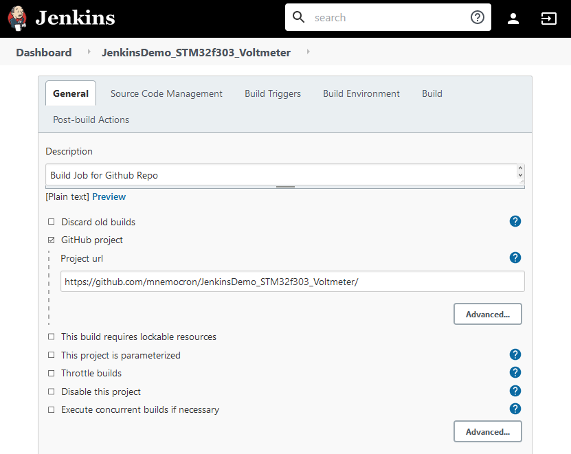
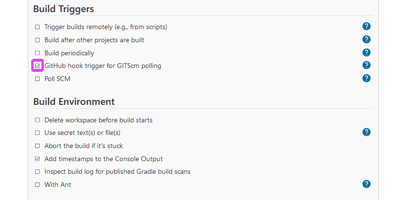
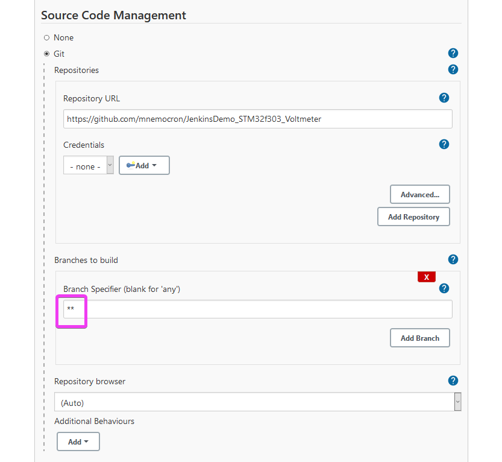
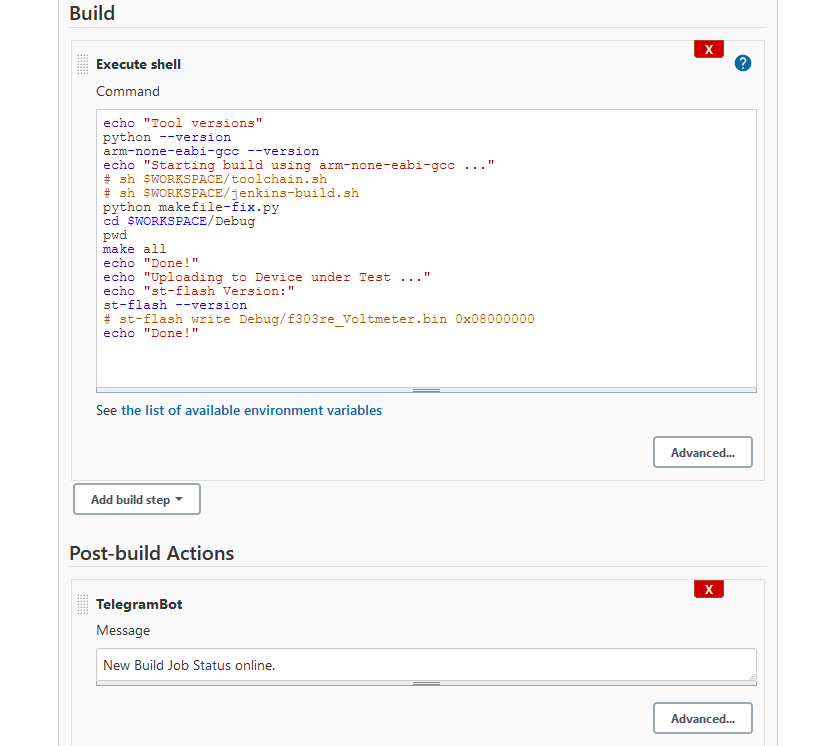
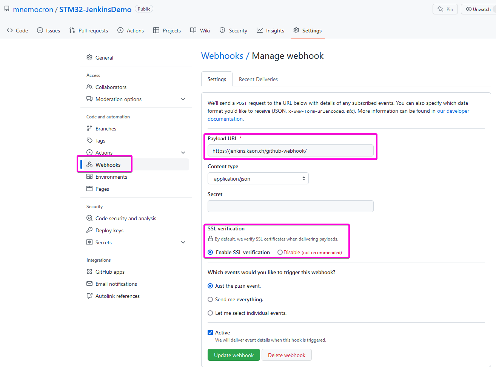

# JenkinsDemo_STM32f303_Voltmeter
STM32f303 Firmware for a simple Voltmeter Demo using the internal 12-Bit ADC and a SSD1306 Display

[](https://jenkins.kaon.ch/job/JenkinsDemo_STM32f303_Voltmeter/)

---

- Jenkins Full Course | Jenkins Tutorial For Beginners [youtube](https://www.youtube.com/watch?v=FX322RVNGj4)
- [how-to-integrate-your-github-repository-to-your-jenkins-project](https://www.blazemeter.com/blog/how-to-integrate-your-github-repository-to-your-jenkins-project)
- GitHub to Jenkins Webhook Trigger [narenchejara.medium.com](https://narenchejara.medium.com/trigger-jenkin-build-on-git-commit-68f6a6920cd0)
- ST-Link Tool on Linux [building-and-flashing-a-program](https://github.com/stlink-org/stlink/blob/develop/doc/tutorial.md)

### Jenkins Installation

The server that Jenkins runs on must have the `arm-none-eabi-gcc` compiler installed.

```bash
sudo apt install gcc-arm-none-eabi
```

---

### Jenkins Config

#### Build

Build Script for "Execute shell" window:

```bash
echo "Tool versions"
python --version
arm-none-eabi-gcc --version
echo "Starting build using arm-none-eabi-gcc ..."
# sh $WORKSPACE/toolchain.sh
# sh $WORKSPACE/jenkins-build.sh
python makefile-fix.py
cd $WORKSPACE/Debug
pwd
make all
echo "Done!"
# echo "Uploading to Device under Test ..."
# echo "st-flash Version:"
# st-flash --version
# st-flash write Debug/f303re_Voltmeter.bin 0x08000000
# echo "Done!"
```






---

### Github Webhooks



